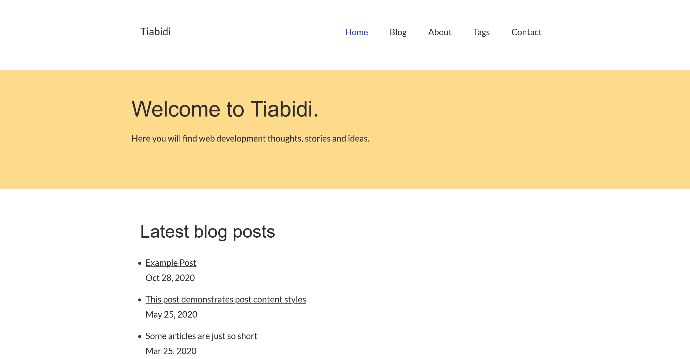

# Welcome to Astro-show

A demo [Astro](https://astro.build) project.


## 🚀 Project Structure

Inside of your Astro project, you'll see the following folders and files:

```
/
├── public/
│   └── favicon.ico
│   ├── admin/
│   │   └── config.yml
├── src/
│   ├── assets/
│   │    └── *.woff
│   │    └── site.css
│   ├── data/
│   │   └── *.md
│   ├── components/
│   │   └── Footer.astro
│   │   └── Header.astro
│   │   └── HeaderLink.astro
│   │   └── Jumbotron.astro
│   │   └── Pagination.astro
│   │   └── PostCard.astro
│   │   └── PostList.astro
│   │   └── Seo.astro
│   ├── layouts/
│   │    └── MainLayout.astro
│   ├── pages/
│       └── about.astro
│       └── contact.astro
│       └── index.astro
│       └── thanks.astro
│       ├── admin/
|       |   └── index.astro
│       ├── blog/
|       |   └── index.astro
|       |   └── [...page].astro
│       ├── post/
|       |   └── [slug].astro
│       ├── tags/
|       |   └── [tag].astro
|       |   └── index.astro
└── package.json
```

Astro looks for `.astro` or `.md` files in the `src/pages/` directory. Each page is exposed as a route based on its file name.

There's nothing special about `src/components/`, but that's where we like to put any Astro/React/Vue/Svelte/Preact components.

Any static assets, like images, can be placed in the `public/` directory.

## 🧞 Commands

All commands are run from the root of the project, from a terminal:

| Command           | Action                                       |
| :---------------- | :------------------------------------------- |
| `npm install`     | Installs dependencies                        |
| `npm run dev`     | Starts local dev server at `localhost:3000`  |
| `npm run build`   | Build your production site to `./dist/`      |
| `npm run preview` | Preview your build locally, before deploying |

## 👀 Want to learn more?

Feel free to check [our documentation](https://github.com/withastro/astro) or jump into our [Discord server](https://astro.build/chat).

## Credits

- [Andy Bell](https://github.com/hankchizljaw/hylia)
- [Astro Blog](https://github.com/withastro/astro/tree/latest/examples/blog)
- [Netlify CMS](https://www.netlifycms.org)
- [Olivia Coumans](https://github.com/liv7c/devblog)
- [Prism Themes](https://github.com/PrismJS/prism-themes)
